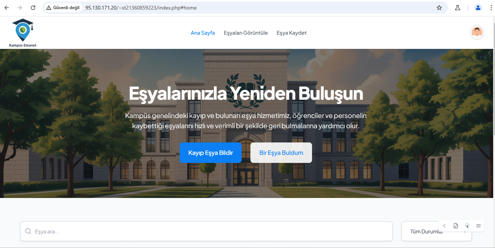
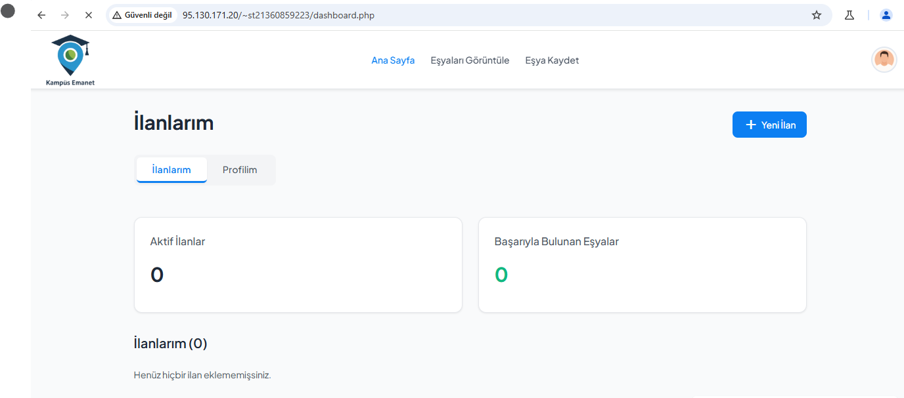

# 🎓 Kampüs Emanet

Kampüs Emanet, üniversite kampüslerinde kaybolan ve bulunan eşyaların bildirilmesini ve yönetilmesini sağlayan, kullanıcı dostu ve mobil uyumlu bir web tabanlı uygulamadır. Öğrenciler ve personel, eşyalarını kolayca ilan edebilir ve bulunan eşyaların sahiplerine ulaşması sağlanabilir.

## 🔗 Proje URL

[https://ibsar.art](https://ibsar.art)

---

## 📌 İçindekiler

- [Proje Açıklaması](#proje-açıklaması)
- [Özellikler](#özellikler)
- [Teknik Gereksinimler](#teknik-gereksinimler)
- [Veritabanı Yapısı](#veritabanı-yapısı)
- [Kurulum](#kurulum)
- [Varsayılan Giriş Bilgileri](#varsayılan-giriş-bilgileri)
- [Ekran Görüntüleri](#ekran-görüntüleri)
- [Video Demo](#video-demo)
- [Güvenlik Uyarısı](#güvenlik-uyarısı)
- [Lisans](#lisans)

---

## 📖 Proje Açıklaması

Kampüs Emanet, kampüs içerisinde kaybolan veya bulunan eşyaların sisteme kaydedilerek listelenmesini sağlar. Kullanıcılar hem kayıp hem de bulunan eşyaları sisteme girebilir, güncelleyebilir ve takip edebilirler. Yönetici paneli ile sistem yönetimi kolaylaştırılmıştır.

---

## 🚀 Özellikler

### 👤 Kullanıcı Özellikleri
- Kullanıcı kayıt ve giriş
- Şifrelenmiş oturum yönetimi
- Kayıp eşya bildirimi
- Bulunan eşya bildirimi
- Eşya düzenleme ve silme
- Profil bilgilerini güncelleme

### 🔐 Yönetici Özellikleri
- Kullanıcı ve eşya ilanlarını yönetme
- Talep edilen eşyaları onaylama/reddetme
- Kategori ve durum güncellemeleri
- Sistem raporları ve istatistikleri

---

## ⚙️ Teknik Gereksinimler

- **Backend**: Core PHP (framework kullanılmadan)
- **Frontend**: HTML5, JavaScript, Tailwind CSS
- **Veritabanı**: MySQL (MariaDB uyumlu)
- **Sunucu Ortamı**: XAMPP / Laragon / MAMP (PHP 8.0+)

### 💡 Güvenlik Özellikleri
- `password_hash()` ile şifreleme
- Session tabanlı giriş kontrolü
- SQL injection önleme (hazırlanmış ifadeler)
- XSS koruması ve input filtreleme
- `htmlspecialchars()` ve `filter_input()` kullanımı

### 🌐 Uyumluluk
- Tam responsive tasarım
- Mobil cihazlarla uyumlu kullanıcı arayüzü
- Türkçe dil desteği
- SEO dostu URL yapıları

---

## 🧩 Veritabanı Yapısı

Veritabanı adı: `lost_found`  
SQL yedeği: `lost_found.sql`

### 🗃️ Tablo Listesi

| Tablo Adı     | Açıklama                                |
|---------------|------------------------------------------|
| `users`       | Kayıtlı kullanıcı bilgileri              |
| `items`       | Eşya ilanları (kayıp / bulunan)          |
| `claims`      | Talep edilen eşyalar                     |
| `categories`  | Eşya kategorileri (ör. telefon, anahtar) |
| `statuses`    | Eşya durumları (bulundu, kayboldu)       |

---

## 🛠️ Kurulum

1. XAMPP veya benzeri bir PHP/MySQL ortamı kurun
2. `lost_found.sql` dosyasını veritabanınıza import edin
3. `includes/db.php` dosyasındaki veritabanı bilgilerini güncelleyin
4. Proje klasörünü sunucunun `htdocs/` dizinine taşıyın
5. `http://localhost/proje-adi` üzerinden tarayıcıdan erişin

---

## 🔐 Varsayılan Giriş Bilgileri

### 👨‍💼 Admin Girişi
- **Email:** admin@kampus.com  
- **Şifre:** 123456

### 👤 Kullanıcı Girişi
- **Email:** user@kampus.com  
- **Şifre:** 123456

> ⚠️ *Güvenlik nedeniyle canlı ortamda bu şifreleri değiştiriniz.*

---

## 🖼️ Ekran Görüntüleri

| Sayfa           | Görsel                        |
|-----------------|-------------------------------|
| Ana Sayfa       |  |
| Kullanıcı Profili |  |

---

## 🎥 Video Demo

🔗 [Video Demosu (Google Drive)](https://drive.google.com/file/d/12ONlWC8bFuIiAML5hbbhkhA6oPsQa0aA/view?usp=sharing)

---

## ⚠️ Güvenlik Uyarısı

Aşağıdaki dosyaları `.gitignore` içerisine eklemeyi unutmayın:

- `includes/db.php`
- `.env` dosyaları
- API anahtarları
- Hosting erişim bilgileri

Bu bilgiler *üretim ortamında (production)* kesinlikle paylaşılmamalıdır.

---

## 📄 Lisans

Bu proje açık kaynaklıdır. [MIT Lisansı](LICENSE) ile lisanslanmıştır.
